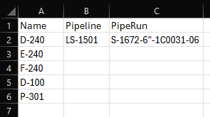

# Picture Taker
This is a more complex sample that can be used to take model screenshots for equipments. It gets an excel file as an import containing a list of tags that screenshots need to be generated for.

Depending on the selection a Zip or PDF is generated.

## To run
THis sample is bigger then other samples and is currently not able to load as an offline App and needs to be available via a web address. A zip only or PDF only version could be run in an offline mode
```bash
npm install
npm run dev
```
## Sample data
Each column represents one tag attribute key to use and all cells beneath it are the values it will search for

